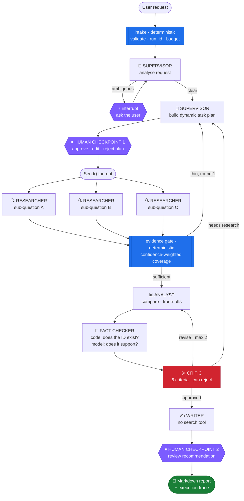

<div align="center">

# 🧠 Multi-Agent Research & Decision Intelligence Platform

**Six specialised AI agents that research a hard question, argue about the answer,
and hand you a report where every claim traces back to a source.**

[](https://python.org)
[](https://langchain-ai.github.io/langgraph/)
[](#-measured-decisions-no-vibes)
[](https://postgresql.org)
[](tests/)

<samp>Visibility Bots Innovation Lab · AI Summer Fellowship 2026 · Track 2: NLP & AI Agents · **Week 4**</samp>

</div>

---

> ### The question this repo exists to answer
>
> **"Why does this workflow need multiple agents, and what measurable value does each one add?"**
>
> Multi-agent systems are not automatically better. They add latency, cost, failure modes and
> debugging pain. This project is an attempt to earn the complexity — and to measure honestly
> where it *wasn't* earned.

---

## Contents

- [What it does](#-what-it-does)
- [The 60-second version](#-the-60-second-version)
- [Architecture](#-architecture)
- [The six agents](#-the-six-agents)
- [What makes it reliable](#-what-makes-it-reliable)
- [Measured decisions](#-measured-decisions-no-vibes)
- [The corpus fights back](#-the-corpus-fights-back)
- [Quick start](#-quick-start)
- [Project structure](#-project-structure)
- [Build status](#-build-status)
- [Known limitations](#-known-limitations)

---

## 🎯 What it does

You give it a genuinely hard question:

```
Compare LangGraph, CrewAI and the OpenAI Agents SDK for a 4-person Python team
building a production multi-agent support system. Recommend one, with reasoning.
```

It does **not** forward that to one model and hope. It decomposes the question, researches each
part in parallel against a controlled corpus, records structured evidence, builds a comparison,
attacks its own conclusions, and produces a report in which **every major claim carries an
evidence ID that a reviewer can follow back to a source.**

Two points in the workflow stop and wait for a human.

---

## ⚡ The 60-second version

Think of a small consulting firm:

| A real firm | This system | Refuses to |
|---|---|---|
| 📋 **Project manager** — scopes the brief | **Supervisor** | do the research itself |
| 🔍 **Junior researchers** — dig through sources | **Researcher** ×N *(parallel)* | draw conclusions |
| 📊 **Senior analyst** — turns findings into a comparison | **Analyst** | search for new facts |
| 🧾 **Compliance** — checks every claim has a source | **Fact-Checker** | judge the argument |
| ⚔️ **Partner** — tears the draft apart | **Critic** | rewrite the answer |
| ✍️ **Writer** — produces the deliverable | **Writer** | invent research |

Nobody at a real firm does all six jobs. **That's the whole argument** — and the "refuses to"
column is enforced in code, not requested in a prompt.

---

## 🏗 Architecture



<div align="center">
<sub>🟦 deterministic code · ⬜ model call · 🟪 human gate · 🟥 quality control</sub>
</div>

**The blue nodes are the interesting part.** Routing decisions that don't need judgement don't
get a model call. Coverage scoring, budget enforcement, citation existence and duplicate
detection are all plain Python — a model is spent only where judgement is actually required.

---

## 🤖 The six agents

<table>
<tr><th>Agent</th><th>Owns</th><th>Tools</th><th>Cannot</th></tr>
<tr>
<td>🧭 <b>Supervisor</b></td>
<td>Request analysis, dynamic plan, routing, completion</td>
<td><code>retrieve_evidence</code></td>
<td>Search. It plans research; it doesn't do it.</td>
</tr>
<tr>
<td>🔍 <b>Researcher</b><br/><sub>N in parallel</sub></td>
<td>One sub-question each. Gathers and stores evidence.</td>
<td><code>search_corpus</code> <code>extract_document</code> <code>store_evidence</code> <code>retrieve_evidence</code></td>
<td>Draw conclusions or compute figures a source never stated.</td>
</tr>
<tr>
<td>📊 <b>Analyst</b></td>
<td>Comparison, trade-offs, conclusions bound to evidence</td>
<td><code>calculate</code> <code>retrieve_evidence</code></td>
<td>Search — so it cannot introduce untraceable facts.</td>
</tr>
<tr>
<td>🧾 <b>Fact-Checker</b></td>
<td>Citation integrity</td>
<td><code>validate_citations</code> <code>retrieve_evidence</code></td>
<td>Judge the argument. Only whether citations hold.</td>
</tr>
<tr>
<td>⚔️ <b>Critic</b></td>
<td>Six review criteria. Approve or reject with fixes.</td>
<td><code>validate_citations</code> <code>retrieve_evidence</code></td>
<td>Rewrite the answer. It evaluates; it doesn't author.</td>
</tr>
<tr>
<td>✍️ <b>Writer</b></td>
<td>The final report</td>
<td><code>export_report</code> <code>retrieve_evidence</code></td>
<td><b>Search.</b> It physically cannot invent research.</td>
</tr>
</table>

> **The sixth agent earns its place.** The Fact-Checker was chosen over other optional specialists
> because it directly produces a required metric — *unsupported major claims below 10%* — and
> because it splits cleanly into a deterministic half and a judgement half.

---

## 🛡 What makes it reliable

### Permission is a property of the call, not a line in a prompt

```python
run_tool("search_corpus", args, ctx, agent_id=AgentId.WRITER)
# ToolPermissionError: Agent 'writer' is not permitted to call 'search_corpus'.
```

The check happens **before** the tool function is reached, and before argument validation, so a
forbidden call fails *as forbidden* even when its arguments are also malformed. Every refused
call is logged with `outcome: permission_denied`.

**29 forbidden agent/tool pairings are enumerated and asserted in the test suite.** A matrix in a
README is a claim; [`tests/test_tools.py`](tests/test_tools.py) is the proof.

### Contracts that refuse bad input

Every handoff is a validated Pydantic object. These are model validators with tests proving each
one rejects:

| Rule | The failure it prevents |
|---|---|
| Empty research **must declare a gap** | A confident paragraph with no evidence reads downstream as substance |
| No evidence → **cannot claim high confidence** | The core hallucination pattern |
| A **major** conclusion **must cite** evidence | Makes "unsupported major claims" structurally impossible |
| A rejection **must name a problem and a fix** | "Not good enough" burns a revision cycle repeating the same mistake |
| An ambiguity flag **must carry questions** | Otherwise the human checkpoint is a dead end |
| Task plans are validated as a **DAG** | A dependency cycle would deadlock the graph *silently* |

### The quote must actually be in the source

`store_evidence` verifies, deterministically, that the supporting text appears in the document
being cited — whitespace-normalised, so reformatting is fine and invention is not.

```python
store_evidence(claim="LangGraph guarantees exactly-once delivery", ...)
# ToolError: supporting_text was not found in 'fw-langgraph-docs'.
```

Source reliability also **caps** confidence: vendor marketing cannot yield a high-confidence
fact however assertively it's written.

### Hard caps, already trip-tested

| Limit | Default | Stops |
|---|---|---|
| Revision cycles | `2` | Critic ↔ Analyst ping-pong |
| Research rounds | `2` | Endless re-planning |
| Model calls per run | `40` | Runaway loops |
| Wall clock | `600s` | Hung runs |
| Estimated spend | `$0.50` | Surprise bills |

### Cross-provider failover

Five OpenAI-compatible providers sit behind one registry. Fallback spans **providers**, not just
models within one — an exhausted quota on the primary continues on the next provider
*mid-workflow*. Pull a key during a run and the workflow still completes, with the switch
recorded in the trace.

---

## 📐 Measured decisions (no vibes)

Every engineering choice here was made from data in
[`scripts/probe_results.json`](scripts/probe_results.json), not from a docs page.

### Which model? Two probes, two different answers

Five candidate models were probed. The naive test — *"can this model emit structured output?"* —
passed **all five**. That test was too easy. The Supervisor needs a *nested* plan with task
dependencies and agent assignment, so a second probe measured that instead:

<div align="center">

| Candidate | Params | Planning score | Critic defects found |
|---|:---:|:---:|:---:|
| **Reasoning tier** *(selected)* | 120B | **10 / 10** | **6 / 6** ✅ |
| **Throughput tier** *(selected)* | 70B | 9 / 10 | 3 / 6 |
| Candidate C | 27B | 5 / 10 | ❌ HTTP 400 |
| Candidate D | 20B | 5 / 10 | ❌ HTTP 400 |
| Candidate E | 8B | 4 / 10 | ❌ HTTP 400 |

</div>

**Three of five hard-fail on nested schemas** with `Tool call validation failed`. The simple
probe said five were usable; the realistic one says two. Exact model ids and raw results live in
[`scripts/probe_results.json`](scripts/probe_results.json).

### The tiering, and why it's defensible

The critic probe plants **six defects** in an analysis and scores detection deterministically.
What the smaller model *missed* decided the architecture:

| | Unsupported claim | Fabricated cite | Wrong cite | Contradiction | Overgeneralised | Missing criterion |
|---|:---:|:---:|:---:|:---:|:---:|:---:|
| **Reasoning tier** | ✅ | ✅ | ✅ | ✅ | ✅ | ✅ |
| **Throughput tier** | ✅ | ✅ | ✅ | ❌ | ❌ | ❌ |

It caught **every citation defect** and **no reasoning defect** — sound where the work is
mechanical, unsound where it is judgement. Hence:

- 🧠 **Judgement tier** *(120B, ~1.2 s)* — Supervisor, Analyst, **Critic**
- ⚡ **Throughput tier** *(70B, ~0.3 s, 50% more tokens/min)* — Researcher ×N, Fact-Checker, Writer

The throughput tier carries the parallel fan-out, where latency multiplies and its extra
tokens-per-minute headroom matters more than its reasoning ceiling.

<details>
<summary><b>A metric that nearly picked the wrong model</b></summary>

<br/>

The first version of the planning probe scored the reasoning-tier model at 6/8 because it returned **zero
tasks** on a vague request. But it had also correctly set `needs_clarification=True` — refusing
to plan until the objective is known is the *right* behaviour, and the scorer was punishing it.

Fixed scorer, waiving structural checks when a plan is correctly withheld → **10/10**, and the
model choice flipped.

This is the Week 3 lesson applied: *audit the metric before you trust it, especially a clean
one.* Several other metrics in this repo carry explicit "can this actually fail?" tests for the
same reason.

</details>

### Retrieval: BM25, deliberately

Twenty lines over 100 chunks. No embedding API, no ~2 GB torch dependency, no index build step.
Queries here are dense with distinctive proper nouns — `LangGraph`, `Fly.io`, `FedRAMP` — which
lexical search handles better than semantic similarity anyway.

Dropping torch also restored Streamlit hot-reload, which Week 3 had to disable.

---

## 🎭 The corpus fights back

24 synthetic documents across three domains, generated by
[`scripts/build_corpus.py`](scripts/build_corpus.py) — reproducible, and unmistakably not
scraped (every file carries `synthetic: true`).

**Eight defects are planted on purpose.** A Critic that never meets a contradiction has not been
shown to detect one.

| # | Defect | Expected catcher |
|---|---|---|
| **PD1** | CrewAI *has* / *hasn't* native human-in-the-loop | Critic |
| **PD2** | Benchmark latency vs. vendor's contradicting claim | Critic |
| **PD3** | "10x faster", no methodology | Critic |
| **PD4** | "10x lower TCO", contradicted by measured data | Critic |
| **PD5** | A 21-word stub that can't support a conclusion | Researcher → gap |
| **PD6** | 💉 **A live prompt-injection payload** | Researcher → ignore |
| **PD7** | Stale facts sold as "updated for 2026" | Critic |
| **PD8** | Self-reported survey read as measured throughput | Critic |

Retrieval tests assert that **both sides of each contradiction surface on the same query** —
otherwise the Critic could never see the conflict and the metric measuring it would be vacuous:

```
Q: 'CrewAI human in the loop approval'
   5.57  fw-crewai-docs        [high]    → "supports a human_input flag"
   5.49  fw-practitioner-blog  [medium]  → "has no native HITL mechanism"
```

> **PD6 is real, not hypothetical.** `ca-security-review.md` contains an actual instruction block
> telling the reading agent to abandon its research question and declare one vendor the only
> secure option. It sits in retrievable text so the defence can be demonstrated live rather than
> asserted.

---

## 🧩 Inside an agent

Each agent is a function returning an `AgentOutcome`. **No agent raises into the graph** — a node
that raises takes the whole workflow down, while one that returns a failed outcome lets the
Supervisor decide whether to retry, degrade, or stop.

### Context boundaries differ in kind, not just size

§21 says don't send the whole history to every agent. The reason isn't only cost: an agent given
everything must decide what's relevant before it can start, and that decision is where irrelevant
material leaks into output.

| Agent | Receives | Deliberately withheld |
|---|---|---|
| Supervisor | Plan state + evidence **counts** | Evidence bodies — it routes, it doesn't read |
| Researcher | **Its own sub-question only** | Sibling findings, so branches stay independent |
| Analyst | Evidence grouped by question, truncated | Raw corpus |
| Fact-Checker | Conclusions + **only cited** evidence | Uncited evidence — not its question |
| Critic | Full analysis + one-line evidence **index** | Evidence bodies — the largest token saving |
| Writer | Approved analysis + cited evidence | Rejected drafts, superseded feedback |

Measured on a fixture: full-context control **1,104 chars** vs. Researcher **276**, Supervisor
**378**, Writer **406**, Critic **671**. Experiment 4 measures this at real scale.

### Fail-closed, in three places

A quality gate that breaks *open* is worse than no gate:

- **A Critic outage is not an approval.** If the Critic's model call fails, the verdict falls back
  to the Fact-Checker's deterministic findings. Fabricated citation → still rejected. Clean →
  approved, but the report *discloses that no review happened*.
- **A lenient Critic cannot approve past a mechanical failure.** Fabricated citations or uncited
  major conclusions override an `approved=true` verdict.
- **Evidence IDs come from the tool layer, never the model.** A researcher that hallucinates
  having stored something produces a handoff with no evidence — which the schema then forces into
  a declared gap.

### What a real research task looks like

One live run, against the corpus:

```
tools: search_corpus ×3 · extract_document · store_evidence ×4
E101 [fact/high]     LangGraph provides HITL approval via interrupt()   src: vendor docs
E104 [claim/medium]  Understanding reducers took most of a week          src: practitioner blog
```

Three searches with different phrasings before concluding, and source type correctly driving
classification — vendor documentation yields `fact`, a blog yields `claim`.

Its prose summary *did* drift, mentioning another framework's API under a LangGraph question. But
**no evidence was stored for that claim.** Drift stayed in prose and never entered the record —
which is the entire argument for evidence-backed reporting.

### The baseline is built now, not later

`app/baseline/single_agent.py` is Experiment 1's control, written alongside the specialists rather
than assembled afterwards when the temptation to weaken it would be strongest.

Same corpus, same tools, same model tier, same metering, same output schema. **The only variable
is architecture** — one agent, one context, no decomposition, no critic, no citation
verification, no revision loop.

It deliberately does *not* filter fabricated citations from its own output. Whether a single agent
invents evidence IDs is precisely what the Fact-Checker exists to prevent, and hiding it would
erase the measurement.

> If the specialists don't beat this, that's a real finding and the builder journal will say so.

---

## 🔀 Orchestration

The graph is twelve nodes. **Every routing decision is a pure function of state** — not one of
them calls a model. That is deliberate: a router that asks an LLM "what should happen next?"
cannot be unit-tested, cannot be proven to terminate, and fails differently on every run.

### Why it always terminates

Three monotonically increasing counters, each compared in `routing.py`:

| Counter | Bounds | Cap |
|---|---|---|
| `revision_count` | the Critic ↔ Analyst loop | 2 |
| `research_round` | re-planning when evidence is thin | 2 |
| `billable_calls` | everything else | 50 |

Because each only increases and each comparison routes **forward** when its cap is met, no cycle
can repeat indefinitely. There's a test that scripts a Critic which rejects *ten times in a row*
and asserts the run still completes, still produces a report, and stops at exactly the cap.

A prompt cannot make that guarantee. A comparison can.

### Failure is a return value, not an exception

Agents return an `AgentOutcome`; nodes turn a failed one into an `ErrorRecord` on state. A node
that raised would abort the graph and discard every piece of evidence gathered so far. Instead:

- One researcher failing → its task is marked `FAILED`, the others continue, the report notes the gap
- A cyclic plan from the model → clean `invalid_output` failure, not a deadlocked graph
- The graph itself blowing up → `run_workflow` still returns a coherent failed result, so the
  evaluation runner *records* the failure rather than dying on it

### Experiments are configuration, not code branches

`critic_enabled`, `max_revisions`, `parallel_research` and `full_context` are flags on the
dependency object. There's a test asserting all five configurations produce an **identical node
set** — because an experiment that requires editing the graph is an experiment whose control arm
is a different program.

---

## 🔬 What running it actually taught us

The graph compiled and the unit tests passed. Then the first real end-to-end run failed — and
each failure was a genuine defect that mocked tests could not have surfaced.

| # | Symptom | Root cause | Fix |
|---|---|---|---|
| 1 | Re-planned forever, budget exhausted | Supervisor produced 10 sub-questions; the plan is capped at N research tasks; the gate scored coverage against **all 10**, so questions nobody was assigned could never be covered | Gate scores only *assigned* questions |
| 2 | Second research round did nothing | A re-plan reuses task ids `R1…Rn`, still marked `COMPLETED` — every task was skipped while still costing a planning call | Reset task status on re-plan |
| 3 | Critic verdict truncated mid-JSON, 152 s of retries | The reasoning model spends tokens reasoning before emitting; the verdict object exceeded the 2048-token ceiling | Raised the output ceiling |
| 4 | Every researcher call doubled in cost, +24 s | The primary model was rate-limited; the retry logic retried it **three times** with backoff before falling through | Rate limits skip straight to the next model — never retried |
| 5 | Circuit breaker fired on a healthy run | Refused calls consumed zero tokens but still counted against the call budget | Budget counts **billable** calls; refusals reported separately |
| 6 | Wall clock blown at 711 s | With both preferred models throttled, the chain fell through to a fallback provider at ~29 s/call | Wait once for the fast model's quota instead of succeeding slowly on a worse one |

Finding #5 is the one worth dwelling on. A single run reported **46 billable calls of 111
attempted — 65 refusals.** Those two numbers answer different questions, and collapsing them into
one made a working system look like a runaway loop.

| 7 | Every call misreported as "rate limited" | `_friendly()` matched the bare substring `"rate"` — which lives inside **"generate"**, so every structured-output failure was classified as throttling | Match `"rate limit"` explicitly |
| 8 | Runs died with quota apparently available | The binding limit is tokens-per-**day**, which the response headers do not expose at all — only the raw 429 body does | Daily quota is now a distinct error class; a second provider supplies headroom |
| 9 | Fixed backoff always wrong | Providers state the exact wait ("retry in 18.5s"); a 6s guess was too short to work and long enough to waste | Parse and honour the provider's stated delay, capped |
| 10 | Test suite writing to the production database | `store=None` meant "unspecified" and fell through to a real store — **52 orphaned rows** were found in the live tables | Sentinel default; `None` now genuinely means no persistence |

> None of these ten were visible from unit tests. They needed real runs against a real,
> rate-limited API. That is the argument for building the sequential path end to end *before*
> adding parallelism.

### The run that completed

```
status          completed          evidence            15
wall_seconds    370.8              revision_count       2  (cap reached)
agent_calls     43 billable        critic_approved  false  (objections recorded)
                98 attempted       fabricated cites  E108  ← caught by the Fact-Checker
tokens          103,035 in / 18,523 out
persisted       15 evidence · 114 trace events · 1 report
```

Three things in that trace are worth more than the completion itself:

- **The Critic rejected all three cycles.** The loop stopped at the cap and shipped anyway — with
  **24 limitations** in the report, including the unresolved objections. §18's guarantee,
  demonstrated against a real adversarial reviewer rather than a mock.
- **`E108` was fabricated, and the deterministic half of the Fact-Checker caught it.** It appears
  in `fabricated_citations` and is absent from the report's 14 cited sources.
- **Source reliability capped confidence live.** A vendor-marketing passage ("CrewAI completing
  standard workflows in under two seconds") was stored as `claim/low`, not `fact`. Planted
  defects PD3 and PD4, handled without a human in the loop.

---

## ⚔️ Measuring the Critic

A Critic that rejects everything scores **100% detection** and is worthless — it burns two
revision cycles on every run and teaches the Analyst nothing. So the benchmark's centrepiece is
a deliberately **clean** analysis that the Critic must approve.

```bash
python eval/critic_bench.py
```

| | |
|---|---|
| **Detection rate** | **12 / 12** (1.0) |
| **False-positive rate** | **0 / 2** (0.0) |
| Rejections actionable | 1.0 |
| Scored all six criteria | 14 / 14 |

Six defect families are planted at the *analysis* level — fabricated citation, internal
contradiction, overgeneralisation from one data point, vendor marketing stated as fact, a
recommendation resting on an unresearched criterion, and a citation that doesn't support its
claim. **Rejecting for the wrong reason doesn't count as a catch**, because the Analyst would
then fix something that was never broken while the real defect survives.

The scorer is calibrated in both directions, and tested:

- an always-approving Critic must score **0** detection
- an always-rejecting Critic must score **100%** false positives

If either assertion failed, the detection rate would be unfalsifiable.

### The control case found five defects — one of them in the system

Getting the "clean" fixture actually clean took five corrections, each surfaced by the Critic:

| # | What the Critic said | Verdict |
|---|---|---|
| 1 | An evaluation criterion was never addressed | **Fixture bug** — the brief asked for three, the analysis covered two |
| 2 | "Offers built-in" overstated evidence saying "supports" | **Fixture bug** — wording tightened |
| 3 | A claim about *cost* cited a *latency* benchmark | **Fixture bug** — I introduced it while fixing #1 |
| 4 | A trade-off asserted a "steeper learning curve" with no evidence | **Fixture bug** — trade-offs are claims too |
| 5 | "The analysis does not provide a recommendation" | 🔴 **Real system bug** |

**#5 is the one that mattered.** The Analyst has no recommendation field and its prompt never
asks for one — recommendations are the Writer's job. **The Critic was reviewing the Analyst
against the Writer's contract**, so it would reject sound analyses on every run and burn both
revision cycles achieving nothing. That almost certainly explains why the live workflow's Critic
rejected all three cycles.

The fix scopes the Critic's remit explicitly, and a regression test pins it.

> A benchmark whose control case only ever confirms what you already believe isn't measuring
> anything. This one found a bug in the system it was built to measure.

---

## ⚡ Parallel research, measured

```bash
python experiments/exp3_parallel_research.py
```

**Experiment 3 — three research tasks, live against the API:**

| Arm | Wall clock | Evidence | Billable calls | Input tokens |
|---|---:|---:|---:|---:|
| Sequential | 249.5 s | 2 | 15 | 24,064 |
| **Parallel** | **95.0 s** | 2 | 15 | 24,670 |

**2.63× speedup — 88% of the 3× theoretical ceiling.**

The columns that aren't the headline matter just as much: identical evidence, identical call
count, tokens within 2.5%. **Parallelism changed latency and nothing else.** A large gap in
either would mean something other than dispatch order differed between the arms, and there's a
check asserting it doesn't.

One honest cost: refused calls rose from 45 to 55. Parallel branches burst against a per-minute
token quota that sequential ones spread out, so on a rate-limited tier some of the speedup is
paid back in retries. Worth knowing before scaling the fan-out width.

### Both arms are the same program

A conditional edge returns either a node name or a list of `Send` objects:

```
plan_approval --> research_dispatch   [approved, sequential]
plan_approval --> research_task       [approved, parallel fan-out]
```

There's a check asserting both flags produce an **identical node set**, because a control arm
that is a different codebase measures two programs rather than one variable.

Each `Send` carries only `{task_id, research_question, objective}`. LangGraph delivers the
payload as the node's input instead of the full state, so a researcher **physically cannot** read
a sibling's findings — §21 isolation becomes structural rather than instructed.

### Proving concurrency, not just structure

"Runs in parallel" is easy to claim and easy to get wrong: a `Send` list that happens to execute
serially looks identical in the trace. So the test measures wall clock against deliberately slow
researchers — 3 tasks × 0.4 s, where sequential execution needs ≥ 1.2 s:

```
measured: 0.41s
```

The experiment harness also has a `--simulate` mode with fixed-cost stub researchers and **zero
API calls**, which reproduces 2.9× of a known 3× ceiling. The instrument is validated before it
is trusted with a measurement.

### The hazard parallelism introduced

`UsageTracker` carried a comment saying a lock would be needed *"if the fan-out ever moves to
real threads."* It has — LangGraph executes synchronous nodes across a thread pool.

`list.append` is atomic under the GIL, but `check_budget` is a **read-modify-write**: two
branches could both observe `cap - 1` and both proceed, overshooting the budget by the width of
the fan-out. Now locked, and stress-tested at **1,200 records across 6 concurrent writers with
zero lost updates**.

---

## 🚀 Quick start

```bash
git clone https://github.com/Rana-Haseeb/multi-agent-research-platform.git
cd multi-agent-research-platform
pip install -r requirements.txt
```

```bash
cp .env.example .env    # then add at least one provider key
```

Only **one** provider key is required. Any of the five supported OpenAI-compatible providers
works; see `.env.example` for the list.

```bash
python scripts/probe_providers.py     # which keys and models actually work
python scripts/build_corpus.py        # generate the 24-document corpus
python scripts/init_db.py             # optional — persistence
python -m pytest tests/ -q            # 100 tests
```

<details>
<summary><b>Configuration reference</b></summary>

<br/>

| Variable | Default | Purpose |
|---|---|---|
| `LLM_PROVIDER` | *see `.env.example`* | Active provider (5 supported) |
| `LLM_FALLBACK_PROVIDERS` | — | Comma-separated cross-provider failover chain |
| `DATABASE_URL` | — | Postgres connection string. Optional. |
| `MAX_REVISION_CYCLES` | `2` | Critic loop hard cap |
| `MAX_AGENT_CALLS_PER_RUN` | `40` | Circuit breaker |
| `MAX_COST_USD_PER_RUN` | `0.50` | Spend ceiling |
| `ENABLE_LIVE_SEARCH` | `false` | Corpus by default, for reproducible evaluation |

**Postgres is optional.** With no `DATABASE_URL` the store no-ops rather than crashing — the
workflow, tests and evaluation all run without a database.

⚠️ If using a managed Postgres with both direct and pooled hosts, use the **pooled (session)**
host — direct hosts are frequently IPv6-only and will not resolve on IPv4-only hosting.

</details>

---

## 📁 Project structure

```
multi-agent-research-platform/
├── app/
│   ├── config.py              ← 5 providers · per-agent model tiers · run budgets
│   ├── schemas/               ← evidence · tasks · 7 handoff contracts · reports
│   ├── graph/                 ← state · nodes · deterministic routing · compiled workflow
│   ├── tools/                 ← 7 tools behind an agent-permission registry
│   ├── storage/               ← BM25 corpus index · Postgres evidence store
│   ├── services/              ← cross-provider LLM · per-agent token metering
│   ├── agents/                ← 6 agents · separate prompts · per-role context builders
│   └── baseline/              ← single-agent control for Experiment 1
├── corpus/                    ← 24 documents + planted_defects.json
├── docs/                      ← generated from live code, never hand-written
├── scripts/
│   ├── probe_*.py             ← the measurements behind every model decision
│   ├── build_corpus.py        ← reproducible corpus generation
│   ├── gen_specs.py           ← docs ← code
│   └── verify_phase*.py       ← per-phase acceptance checks
└── tests/                     ← 100 tests, no network required
```

> **Docs are generated, not written.** `A2_state_specification.md`,
> `A3_handoff_contracts.md` and `A4_tool_specification.md` are built from
> `FIELD_PERMISSIONS` and the live Pydantic models. A spec that contradicts the code is worse
> than no spec — it misleads whoever trusts it.

---

## 📊 Build status

Every phase ends with an acceptance script that checks claims against the code, because *"done"
reported from memory is not done*.

| Phase | Scope | Checks | Status |
|---|---|:---:|:---:|
| **0** | Scaffold · 5 providers · metering · model selection | 42/42 | ✅ |
| **1** | Schemas · shared state · 7 handoff contracts | 22/22 | ✅ |
| **2** | 24-doc corpus · BM25 · Postgres evidence store | 26/26 | ✅ |
| **3** | 7 tools · permission boundaries · audit log | 23/23 | ✅ |
| **4** | Six agents · context boundaries · single-agent baseline | 30/30 | ✅ |
| **5** | Orchestration graph · routing · termination · persistence | 36/36 | ✅ |
| **6** | Critic loop · detection-rate benchmark · false-positive control | 23/23 | ✅ |
| **7** | Parallel fan-out · thread safety · Experiment 3 measured | 24/24 | ✅ |
| 8 | Human checkpoints · dashboard · export | — | ⏳ |
| 9 | Automated tests | — | ⏳ |
| 10 | 25 eval cases · 5 experiments · 10 adversarial | — | ⏳ |
| 11 | Docs · security review · deploy | — | ⏳ |

```bash
for p in 0 1 2 3 4 5 6 7; do python scripts/verify_phase$p.py; done
```

**Current: 222/222 acceptance checks · 196 tests passing.**

`python scripts/verify_phase4.py --live` adds 4 further checks that run a real research task
against the API rather than mocks.

---

## ⚠️ Known limitations

Stated plainly, because a limitation you disclose is engineering and one you hide is a defect.

- **The corpus is synthetic.** 24 documents written for this project. Retrieval quality on real
  web sources is unmeasured. Live search exists behind `ENABLE_LIVE_SEARCH` but isn't the
  evaluated path.
- **No end-to-end workflow numbers yet.** Agents are verified individually and one live research
  task runs per build, but full-workflow latency, cost and quality figures arrive in Phase 10
  from actual runs. This README will not carry an estimated metric.
- **BM25, not semantic search.** Adequate for 24 keyword-dense documents; a paraphrased query
  with no shared vocabulary will retrieve poorly.
- **Free-tier rate limits.** The default configuration runs on free provider tiers with daily
  request quotas. Sufficient for the ~480 calls this project plans, not for sustained load.
- **Single-language corpus.** English only.
- **Cost tracking reads $0.00 on free tiers.** Token counts are real and measured per agent; USD
  figures only become meaningful when running against a paid provider.

---

<div align="center">
<br/>

**Built by [Rana Muhammad Haseeb Khan](https://github.com/Rana-Haseeb)**
<br/>
<sub>FAST NUCES · Software Engineering · Visibility Bots AI Fellowship 2026</sub>

<br/>

<sub><i>More agents is not better. Every agent must earn its latency and its cost.</i></sub>

</div>
