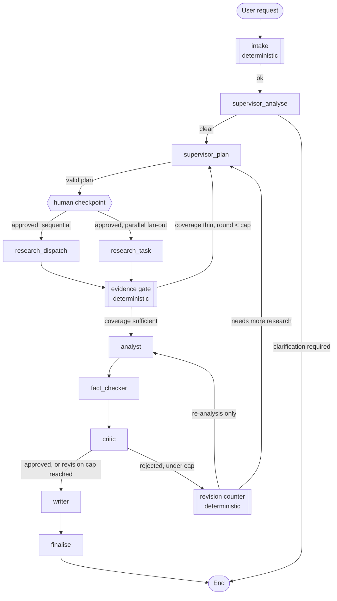

<!-- GENERATED by scripts/gen_specs.py on 2026-08-03. Do not edit by hand. -->

# Workflow Architecture (§7, §8, §18, §22)

Generated from the compiled graph, so the diagram cannot drift from the code that runs.

## Topology



## Edges

```
  __start__            -> intake               
  intake               -> supervisor_analyse   [ok]
  supervisor_analyse   -> supervisor_plan      [clear]
  supervisor_analyse   -> __end__              [clarification required]
  supervisor_plan      -> plan_approval        [valid plan]
  plan_approval        -> research_dispatch    [approved, sequential]
  plan_approval        -> research_task        [approved, parallel fan-out]
  research_task        -> evidence_gate        
  research_dispatch    -> evidence_gate        
  evidence_gate        -> supervisor_plan      [coverage thin, round < cap]
  evidence_gate        -> analyst              [coverage sufficient]
  analyst              -> fact_checker         
  fact_checker         -> critic               
  critic               -> writer               [approved, or revision cap reached]
  critic               -> revision             [rejected, under cap]
  revision             -> analyst              [re-analysis only]
  revision             -> supervisor_plan      [needs more research]
  writer               -> finalise             
  finalise             -> __end__              
```

## Why the workflow always terminates

Three counters, each compared in `app/graph/routing.py`. Every one increases
monotonically, and every comparison routes **forward** once its cap is met, so no cycle
can repeat indefinitely.

| Counter | Bounds | Cap |
|---|---|---|
| `revision_count` | the Critic to Analyst loop | 2 |
| `research_round` | re-planning when evidence is thin | 2 |
| `billable_calls` | everything else | 50 |
| wall clock | a hung run | 900s |

`tests/test_workflow.py::test_workflow_terminates_when_critic_rejects_forever` asserts
this against a Critic scripted to reject ten times in a row.

## Deterministic versus agentic

Routing never calls a model. Coverage scoring, budget enforcement, citation existence,
duplicate-task detection and revision counting are plain Python; a model is spent only
where judgement is genuinely required.

## Failure handling (§22)

| Failure | Response |
|---|---|
| Agent returns invalid output | Reported as a failed `AgentOutcome`; the run ends cleanly with the error recorded |
| One researcher fails | Its task is marked FAILED, siblings continue, the gap reaches the report |
| Model API failure | Cross-provider fallback; a stated `retry-after` is honoured, capped |
| Daily quota exhausted | Distinct from a rate limit — the chain moves on rather than waiting |
| Critic unavailable | Falls back to the Fact-Checker's deterministic findings; never auto-approves |
| Duplicate research tasks | Collapsed before execution by string similarity |
| Dependency cycle in a plan | Rejected at construction, before the graph can deadlock |
| Database unreachable | Persistence no-ops; the run still completes |
| Runaway loop | Revision, research-round, call and wall-clock caps |
